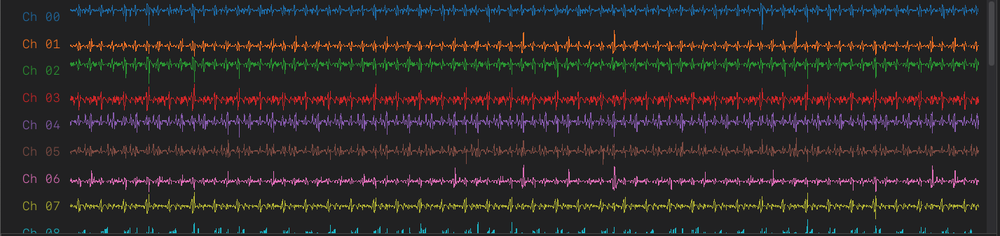
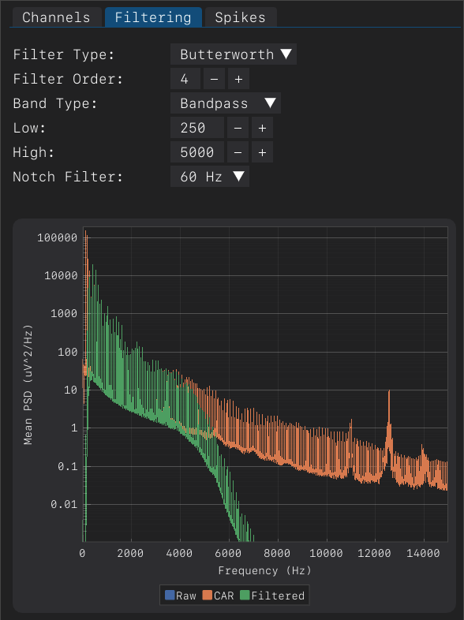

# EphysViz User Guide
### Table of Contents

1. **[Menu Bar](#menu-bar)**
    - 1.1 [Opening a File](#opening-a-file)
    - 1.2 [Setting Default Settings](#setting-default-settings)
    - 1.3 [Setting Default Directory](#setting-default-directory)

2. **[Plots Window](#plots-window)**
    - 2.1 [Plot Controls](#plot-controls)
    - 2.2 [Amplifier Channel Plots](#amplifier-channel-plots)
    - 2.3 [Analog Channel Plots](#analog-channel-plots)
    - 2.4 [Time Controls](#time-controls)

3. **[Tabs Window](#tabs-window)**
    - 3.1 [Channels](#channels)
    - 3.2 [Filtering](#filtering)
    - 3.3 [Spikes](#spikes)
        - 3.3.1 [Spike Panel](#spike-panel)
    

## Menu Bar

- **Open...**
    - This opens a new `.rhs`/`.RHS` file using the same file selection dialog used when the app opens.
- **Save Settings as Default**
    - This saves the current settings to a `settings.ini` file so that they are set upon opening the app.
- **Setting Default Directory**
    - This opens a folder selection dialog and saves the folder to the `settings.ini` file so that this folder will be the default directory of the file selection window.

## Plots Window

### Plot Controls

- **Plot Type:**
    - This sets the type of data plotted in the amplifier data plots. Choices are: 
        - `Raw`: This is the raw 30 kHz amplifier data
        - `Re-Referenced`: This is the common average referenced 30kHz data
        - `Filtered`: This is the common average referenced and filtered 30kHz data
- **Show Spikes:**
    - This toggles an upwards arrow / triangle below the the voltage traces where the voltage crosses the threshold.

  
  <!--  -->

- **Playback Speed:**
    - This changes the speed of the "play" function found in the [time controls](#time-controls). The multiplier is applied to the amount of frames that are loaded in between updates, where 1x is the same speed as it was recorded. If the zoom is too much then the play will move too fast to be useful, this dropdown is to slow down / speed up the playback speed based on the the zoom level.

- **Amp. Ch Heights:**
    - This changes the height (in pixels) of the [amplifier channel plots](#amplifier-channel-plots). Whole number can be entered (enter button must be pressed to apply changes) or the +/- buttons can be used to change the height by 1 pixel at a time (can be held down).

- **An. Ch Heights:**
    - This changes the height (in pixels) of the [analog channel plots](#analog-channel-plots). Whole number can be entered (enter button must be pressed to apply changes) or the +/- buttons can be used to change the height by 1 pixel at a time (can be held down).

### Amplifier Channel Plots

- **Mouse Position Label**
    - When hovering over a plot you will see a label in the bottom left conrner in the format of: `Samples (30kHz)`, `Voltage (uV)`

  

- **Zooming** 
    - Mouse scroll while hovering over the plot will zoom in/out on the plot. The zoom is centered on the mouse position. 

- **Scrolling Channels** 
    - Mouse scroll while hovering over the channel names on the left side of the plot or the scrollbar on the right side of the plots will scroll the channels up/down.

- **Panning**
    - Clicking and dragging on the plot will pan the plot in time. The plot can also be panned with the [time controls](#time-controls) slider.

- **Time Ruler** 
    - Clicking with the middle mouse button and dragging will create a ruler that shows the time difference between the start and end of the ruler. The ruler can be moved by clicking and dragging the ruler. The ruler can be removed by clicking the middle mouse button again.

  

### Analog Channel Plots

Analog channel plots are the same as the [amplifier channel plots](#amplifier-channel-plots) except that they also have the unique ability to be resized by dragging the top of the plot. Hover your mouse over the top of the plot until you the pointer turns into the following icon: 

  

### Time Controls

The axis label is for both the amplifier and analog plots and shows the time (in milliseconds) into the recording. Below that you have the "Media" style controls:

- **|<**
    - This will jump to the start of the recording.

- **Play**
    - This will play the recording from the current position to the end of the recording. The speed of the play can be changed with the [plot controls](#plot-controls) dropdown.

- **Pause**
    - This will pause the play function, by default the recording will be paused.

- **Time Slider**
    - This slider can be used to move the current position in the recording. The blue bar shows both the current position in the recording (position relative to light gray bar) and the amount of the recording that is visible (width relative to light gray bar). The slider can be moved by clicking and holding on the light gray bar or by dragging the blue slider. The text to the left of the slider shows the current minutes and seconds of the recording in the format: `Elapsed MM:SS` / `Total MM:SS` where the elapsed time is the left hand side of the visible window.

- **>|**
    - This will jump to the end of the recording.

## Tabs Window

### Channels

<table>
  <tr>
    <td>
      
    </td>
    <td width="500">
      <h3>Impedance Limit</h3>
      <ul>
        <li>Sets the limit for which all channels with an impedance over this will not be included in CAR and not be plotted. The include / plot buttons for those channels will become disabled (meaning they cant be interacted with) and turn red.</li>
      </ul>
      <h3>Channel List</h3>
      <ul>
        <li>Displays a comprehensive list of all channels with their respective properties like channel number, name, and impedance values.</li>
        <ul>
            <li>Channel: The channel number</li>
            <li>Impedance: The impedance value of the channel</li>
            <li>Plot: Whether or not the channel is plotted in the amplifier plots</li>
            <li>Include in CAR: Whether or not the channel is included in the common average reference calculation</li>
        </ul>
      </ul>
      <h3>Impedance Plot</h3>
      <ul>
        <li>Visualizes the impedance values of each channel in a graphical format, aiding in quick assessment of channel quality.</li>
      </ul>
    </td>
  </tr>
</table>

### Filtering
<table>
  <tr>
    <td>
      
    </td>
    <td>
      <h3>Filtering Parameters</h3>
      <ul>
        <li>Enables customization of filtering parameters like cutoff frequencies, allowing users to refine signal processing.</li>
      </ul>
      <h3>PSD Plot</h3>
      <ul>
        <li>Shows the Power Spectral Density (PSD) plot, providing insights into the frequency distribution of the recorded signals.</li>
      </ul>
    </td>
  </tr>
</table>

### Spikes
<table>
  <tr>
    <td>
      
    </td>
    <td>
      <h3>Threshold Multiplier</h3>
      <ul>
        <li>Allows adjustment of the threshold multiplier for spike detection, tailoring the sensitivity of spike identification.</li>
      </ul>
      <h3>View All Channels</h3>
      <ul>
        <li>Enables simultaneous viewing of spike activity across all channels, offering a comprehensive overview.</li>
      </ul>
      <h3>Single Channel Threshold Crossings</h3>
        <ul>
            <li><b>Channel to Plot:</b></li>
            <ul>
                <li>Facilitates selection of a specific channel for detailed analysis of spike events and threshold crossings.</li>
            </ul>
            <li><b>Show Threshold:</b></li>
            <ul>
                <li>Activates the display of threshold lines on the plot, making it easier to visualize spike occurrences.</li>
            </ul>
            <li><b>Threshold Crossings Plot</b></li>
            <ul>
                <li>Provides a detailed visual representation of moments where the signal crosses the set threshold on the selected channel.</li>
            </ul>
            <li><b>Plot Crossings within Range:</b></li>
            <ul>
                <li>Enables users to focus on spike events within a specific time range, enhancing targeted analysis.</li>
            </ul>
            <li><b>Exclude Period:</b></li>
            <ul>
                <li>Offers the option to exclude a specific period from the spike analysis, useful in eliminating artifacts or irrelevant data segments.</li>
                <li><b>Period to Exclude</b>: Allows setting of the specific time range to be excluded from analysis.</li>
            </ul>
    </td>
  </tr>
</table>

#### Spike Panel

<li><b>Plot Crossings within Range:</b></li>
<ul>
    <li>Enables visualization of spike threshold crossings within a user-defined time range, facilitating focused analysis of spike

 activity.</li>
</ul>

<!-- ### Channels

<table>
  <tr>
    <td>
      
    </td>
    <td>
      <h3>Impedance Limit</h3>
      <ul>
        <li>Content for sub list item 1 goes here.</li>
      </ul>
      <h3>Channel List</h3>
      <ul>
        <li>Content for sub list item 1 goes here.</li>
      </ul>
      <h3>Impedance Plot</h3>
      <ul>
        <li>Content for sub list item 1 goes here.</li>
      </ul>
    </td>
  </tr>
</table>

### Filtering
<table>
  <tr>
    <td>
      
    </td>
    <td>
      <h3>Filtering Parameters</h3>
      <ul>
        <li>Content for sub list item 1 goes here.</li>
      </ul>
      <h3>PSD Plot</h3>
      <ul>
        <li>Content for sub list item 1 goes here.</li>
      </ul>
    </td>
  </tr>
</table>

### Spikes
<table>
  <tr>
    <td>
      
    </td>
    <td>
      <h3>Threshold Multiplier</h3>
      <ul>
        <li>Content for sub list item 1 goes here.</li>
      </ul>
      <h3>View All Channels</h3>
      <ul>
        <li>Content for sub list item 1 goes here.</li>
      </ul>
      <h3>Single Channel Threshold Crossings</h3>        <ul>
            <li><b>Channel to Plot:</b></li>
            <ul>
                <li>Content for sub list item 1 goes here.</li>
            </ul>
            <li><b>Show Threshold:</b></li>
            <ul>
                <li>Content for sub list item 1 goes here.</li>
            </ul>
            <li><b>Threhold Crossings Plot</b></li>
            <ul>
                <li>Content for sub list item 1 goes here.</li>
            </ul>
            <li><b>Plot Crossings within Range:</b></li>
            <ul>
                <li>Content for sub list item 1 goes here.</li>
            </ul>
            <li><b>Exclude Period:</b></li>
            <ul>
                <li>Whether or not the period in time defined by the slider below is excluded from the threshold calculation / threshold crossing plots</li>
                <li><b>Period to Exclude</b>: </li>
            </ul>
    </td>
  </tr>
</table>

#### Spike Panel

<li><b>Plot Crossings within Range:</b></li>
<ul>
    <li>Content for sub list item 1 goes here.</li>
</ul> -->